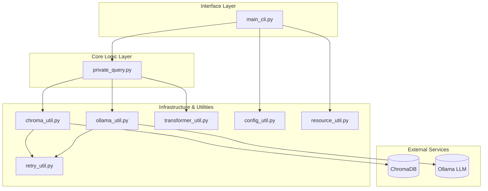

# Private Query: System Design and Architecture

## 1. Introduction
Private Query is a Retrieval-Augmented Generation (RAG) system designed for secure, local processing of private datasets. It enables users to embed various document formats into a vector store and execute natural language queries against that data using local Large Language Models (LLMs).

## 2. Architectural Principles
- **Privacy-First**: Designed to run locally (via Ollama) to ensure data never leaves the user's environment.
- **Modularity**: Separation of concerns between CLI handling, core business logic, vector storage, and LLM execution.
- **Resilience**: Implementation of retry strategies for external service interactions (Ollama, ChromaDB).
- **Environment Agnostic**: Robust resource resolution supporting standard Python and Bazel-managed runtimes.

## 3. High-Level Architecture

## 4. Component Details

### 4.1. Interface Layer
- **`main_cli.py`**: Utilizes `typer` to provide a user-friendly CLI. It manages session initialization, configuration loading, and command routing (`load`, `query`).

### 4.2. Core Logic Layer
- **`private_query.py`**: The central orchestrator. It defines the `PrivateQuery` class which:
    - Coordinates document ingestion by extracting text via `transformer_util.py`.
    - Manages embedding and storage via `chroma_util.py`.
    - Orchestrates the RAG flow: retrieving context from the vector store and generating responses via `ollama_util.py`.

### 4.3. Infrastructure & Utility Layer
- **`chroma_util.py`**: Encapsulates interactions with the Chroma vector database. Handles collection management, document batching, and token-based text chunking using HuggingFace tokenizers.
- **`ollama_util.py`**: Manages the connection to local LLMs via Ollama. It ensures the required model is pulled and handles prompt execution.
- **`transformer_util.py`**: Provides specialized extractors for `.pdf`, `.docx`, and `.txt` files, abstracting file type complexity from the core logic.
- **`resource_util.py`**: A specialized utility for resolving file paths across varied execution environments, specifically handling Bazel's runfiles system.
- **`retry_util.py`**: Implements a random exponential backoff strategy using `tenacity` to improve system robustness.

## 5. External Dependencies

| Dependency | Purpose |
| :--- | :--- |
| `chromadb` | Vector database for efficient similarity search. |
| `ollama` | Local LLM execution engine. |
| `sentence-transformers` | Generating high-quality text embeddings. |
| `transformers` | Tokenization for accurate text chunking. |
| `typer` | CLI framework. |
| `loguru` | Structured and configurable logging. |
| `pydantic` | Data validation and configuration management. |
| `pypdf` / `python-docx` | Document parsing. |
| `tenacity` | Declarative retry logic. |

## 6. Data Flow
1. **Ingestion**: 
    - User provides a file/directory path.
    - `resource_util` resolves paths.
    - `transformer_util` extracts text.
    - `chroma_util` chunks text and generates embeddings.
    - Embeddings are stored in `ChromaDB`.
2. **Querying**:
    - User submits a prompt.
    - `PrivateQuery` queries `ChromaDB` for the most relevant context chunks.
    - A context-augmented prompt is constructed.
    - `Ollama` executes the prompt and returns the final answer.
